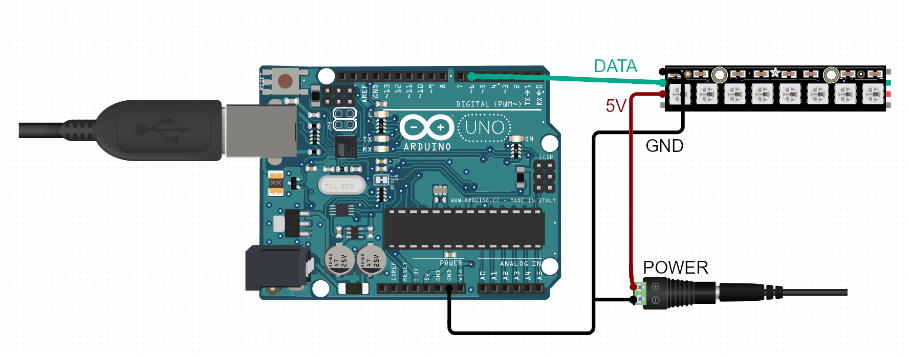

# Ambilight - PC

Project created by 4 students for the subject: Embedded systems.

It lights up LED's behind your screen.

## General Info 

It captures screen, extracts borders from picture, devides it into N (number of diodes for each site) parts and converts it into numpy arrays. Counts average color of an array.
It sends data about diode colors to Arduino and the code that controls the tool itselfs. 

## Technologies 
* Python
* NumPy
* pyserial
* mss library

## Installation
* You need:
	* Arduino UNO
	* LED strip in needed length
	* 5V DC power supply
* Setup:
	* Attach LED strip on the back of the screen from left-bottom corner. (Left and right as well as top and bottom must have the same number of LEDs each.)
	* Connect Arduino to your USB port.
	* Connec LED strip to Arduino. Scheme:
	
	* Install needed libraries (NumPy, pyserial, mss)	
	* Run main.py
	
## Extras
There is also a program that visualizes the captured colors. (gui.py)
